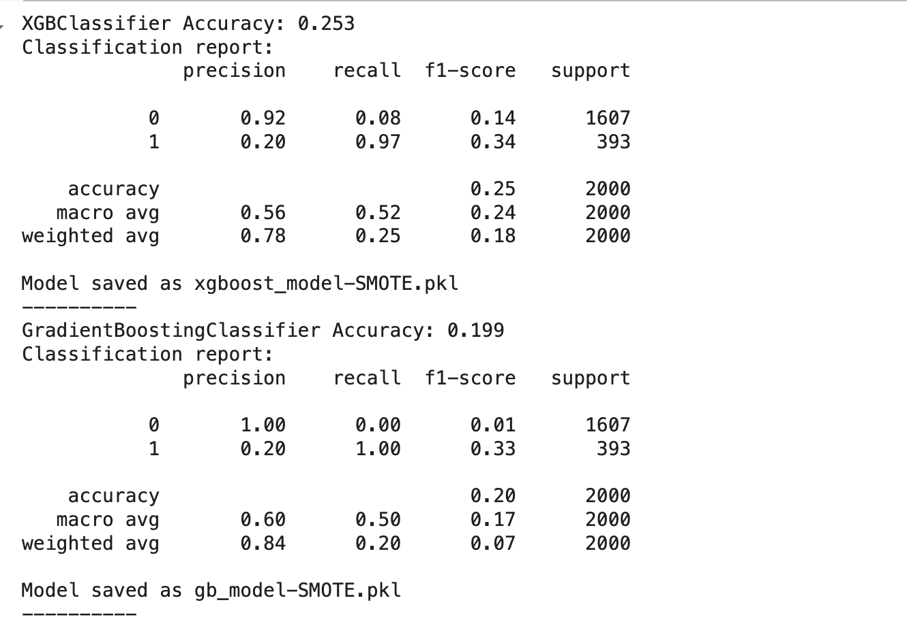
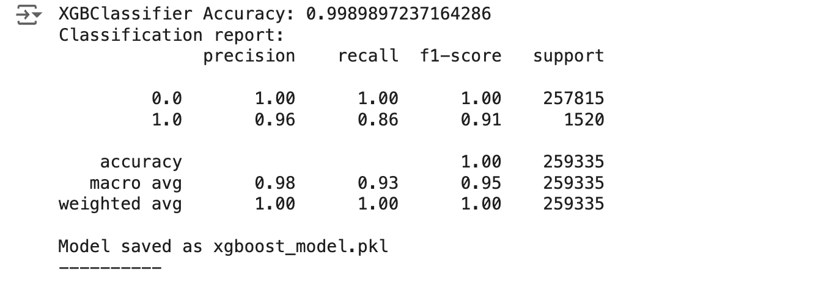

# Customer Churn Prediction Project

🚀 Live Demo: [Churn & Prediction App](https://churn-render.onrender.com/)

## Overview

This project leverages machine learning to predict customer churn in the banking sector. By identifying at-risk customers, we aim to help banking professionals take proactive measures, retain customers, and improve long-term customer relationships. The model not only predicts churn but also provides insights into customer risk factors and can be integrated into personalized retention strategies, such as tailored incentives.

## Key Features

- Churn Prediction: Uses advanced ML models to predict the likelihood of customer churn.
- Risk Factor Analysis: Highlights reasons for each customer’s risk of attrition.
- Personalized Retention Campaigns: Generates custom email incentives based on customer risk factors.
- Fraud Detection: Employs ML models to flag potential fraudulent transactions.

**_ Table of Contents _**

1. Data Preprocessing
2. Model Training and Evaluation
3. Acknowledgments

Project Structure

### Data Preprocessing

This project uses a dataset from Kaggle (linked in Resources) that contains 14 features. Key preprocessing steps include:

- Feature Selection: Dropping irrelevant columns such as CustomerId and Surname.
  Encoding Categorical Variables: Converting Geography and Gender columns to numerical using one-hot encoding.
- Data Scaling: Standardizing features to improve model performance.

### Model Training and Evaluation

The following models were trained and evaluated on the processed dataset:

- XGBoost
- Gradient Boosting
- Random Forest
- Decision Tree
- Naive Bayes
- Support Vector Classifier (SVC)

Each model was evaluated using accuracy, precision, recall, and F1-score, with a focus on recall to capture at-risk customers.

Here are the performances for each of our models:

For Fraud detection here how the best version of the model performed

### Balancing Techniques

Given the imbalance in churn vs. non-churn customers, SMOTE (Synthetic Minority Oversampling Technique) was used to balance the dataset, enhancing recall performance.

### Acknowledgments

Thanks to the Headstarter team for their guidance and feedback.A special thanks to Faizan (Co-founder) for his support and mentorship.

Dataset: [Kaggle - Churn for Bank Customers](https://www.kaggle.com/datasets/mathchi/churn-for-bank-customers)
Preprocessing insights: [LakeFS Blog on Data Preprocessing](https://lakefs.io/blog/data-preprocessing-in-machine-learning/)
